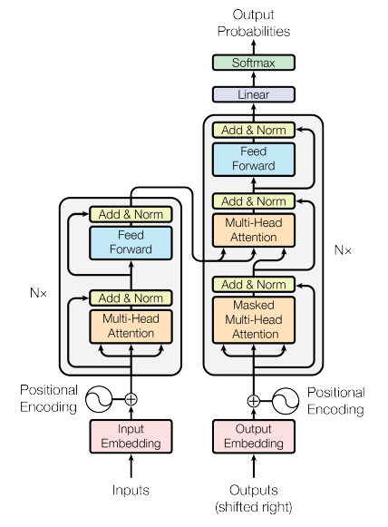

# Attention is all you need implementation in PyTorch

This is a PyTorch implementation of the the paper [Attention is All You Need](https://arxiv.org/abs/1706.03762).

<p align="center"></p>

## Requirements

The different packages used to develop this project are listed in the `requirements.txt` file. To install them, run the following command:

```bash
pip install -r requirements.txt
```

Other similar versions will probably work just fine.
Python 3.11 was used.

## Usage

### Configuration

Example configuration files are provided in the `configs` directory. The configuration files are written in YAML format and contain the hyperparameters for the model, the dataset, and the training process.
For example:

```yaml
dataset:
  ds_name: wmt14
  src_lang: en
  tgt_lang: de
  split: -1 # Automatically handled

model:
  num_heads: 8
  d_model: 512
  d_k: 64
  d_v: 64
  d_ff: 2048
  dropout: 0.1
  n_encoder_layers: 6
  n_decoder_layers: 6
  src_vocab_size: 32000
  tgt_vocab_size: 32000

training:
  max_global_steps: 100000
  # original -> 25k tokens per batch -> 25k / 4 = 6250 tokens per gpu
  tokens_per_step_per_gpu: 6250
  n_gpus: 4
  lr: 1
  use_scheduler: true
  b1: 0.9
  b2: 0.98
  eps: 0.0000000001 # 1e-9
  warmup_steps: 4000
  checkpoint_dir: "checkpoints/distrib_wmt14"
  checkpoint_filename: "latest"
  checkpoint_save_filename: "checkpoint.pth"
  save_freq: 1000 # each 1000 steps
  label_smoothing: 0.1

eval:
  batch_size: 128
  checkpoint_dir: "checkpoints/distrib_wmt14"
  checkpoint_filename: "latest"
```

### Steps for training

To prepare everything for training, follow these steps (in order) (you can use any configuration file. Just make sure n_gpus matches the torchrun command):

1. Train the tokenizer

```bash
    python tokenizer.py --config configs/distrib_wmt14.yaml
```

This will create a tokenizer (using the Tokenizers library) and save it. It will use the 'raw' unprocessed dataset.

2. Preprocess the dataset (pretokenize it)

```bash
    python dataset.py --config configs/distrib_wmt14.yaml --task preprocess
```

This will preprocess (pre-tokenize and sort) the dataset and save it. It will use the tokenizer created in the previous step.

3. Organize the dataset

```bash
    python dataset.py --config configs/distrib_wmt14.yaml --task organize_batches
```

The original paper mentions about x=25k source + x target tokens per batch. To avoid excessive runtime overhead, this will pre-batch the dataset into said batches (configurable).
More on this later.
Optionally, to see stats about the batches, run

```bash
    python dataset.py --config configs/distrib_wmt14.yaml --task print_batch_stats
```

4. Run the training script

```bash
    torchrun --nproc_per_node 4 train.py --config configs/distrib_wmt14.yaml
```

This will start the training process. The script will load the dataset, the model, and the configuration file. It will train the model and save it in the `checkpoints` directory.
It will save the model every `save_freq` steps. It will save the optimizer state and other stuff needed to resume training. It is not ideal to resume training mid-epoch.

## Batching

The original paper mentions that each batch should have `x` source and `x` target tokens. To be efficient with batch padding, it also mentions that sentences are grouped by approximate token length. In the paper, `x` = 25k.

When the dataset is pre-tokenized, it is also sorted by length.
Then, we have the batching process. For a given number of gpus and desired `x`, it will divide the epoch (dataset) into batches of approximately `x` source and `x` target tokens, into each gpu (2 gpus will not see the same sequences).

At runtime, the order in which the batches are processed is shuffled, but the batches themselves remain constant.

Each batch is then padded to the maximum length of the batch.

## Citations

```bibtex
@misc{vaswani2023attention,
      title={Attention Is All You Need},
      author={Ashish Vaswani and Noam Shazeer and Niki Parmar and Jakob Uszkoreit and Llion Jones and Aidan N. Gomez and Lukasz Kaiser and Illia Polosukhin},
      year={2023},
      eprint={1706.03762},
      archivePrefix={arXiv},
      primaryClass={cs.CL}
}
```
